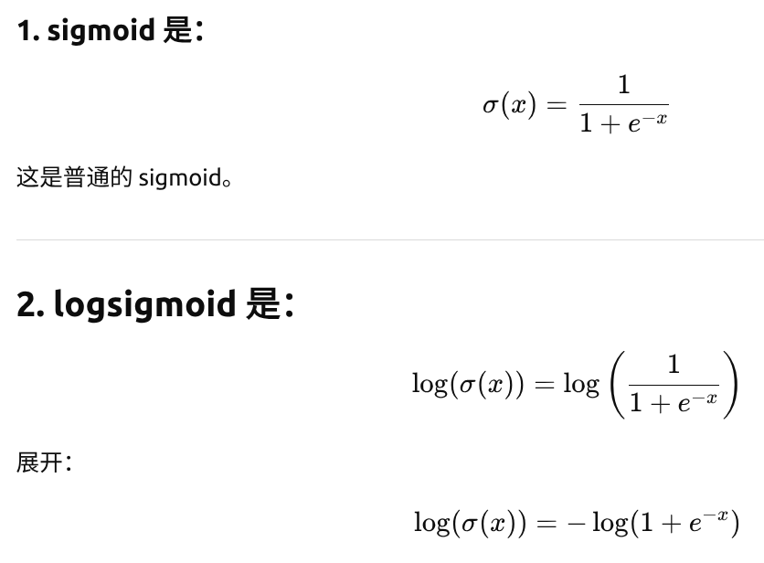
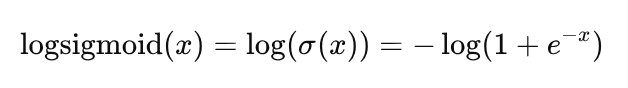

## 分支 / 工作说明

此分支学习 DPO 相关内容

## DPO 训练运行入口

debug `trl/scripts/dpo.py` with `.vscode/launch.json` dpo settings

## DPO 代码细节 

此对话记录了 DPO Trainer 训练器的初始化细节：https://deepwiki.com/search/_e6595ca7-8154-4ce9-a3a6-5f4baacb0ccf?mode=fast#4

### _DPO 算法细节_

DPO 算法的核心思想是将强化学习问题转化为监督学习问题：

- Policy Model：要训练的模型，生成 chosen 和 rejected 响应的概率

- Reference Model：提供基线概率，防止模型偏离原始分布太多

通过比较两个模型在相同输入上的对数概率差异，DPO 直接优化偏好损失，无需显式的奖励模型

### _DPO Trainser 内部封装的各个方法的作用以及训练细节_

- https://deepwiki.com/search/_e6595ca7-8154-4ce9-a3a6-5f4baacb0ccf?mode=fast#5

- https://deepwiki.com/search/_e6595ca7-8154-4ce9-a3a6-5f4baacb0ccf?mode=fast#6

- trainer.train() 方法是如何进入到 DPOTrainer 内部封装的各种源码的，即代码的执行流程是什么：

    https://deepwiki.com/search/_e6595ca7-8154-4ce9-a3a6-5f4baacb0ccf?mode=fast#8
    
- 训练过程

    - compute_loss 训练入口点， trainer.train() 会进入到这个方法，相当于 API
    
    - get_batch_loss_metrics  API 方法内部的训练过程，是真正的训练过程的入口，其内部有很多训练过程的计算环节

        - concatenated_forward：此方法是 DPO 训练的核心优化方法，它将 chosen 和 rejected 样本拼接在一起，一次性通过模型获得所有概率，避免两次前向传播

            https://deepwiki.com/search/_e6595ca7-8154-4ce9-a3a6-5f4baacb0ccf?mode=fast#11

            这里可以看到，DPO 的 policy model 是需要完整的 response 的：https://gemini.google.com/share/bd1a7393c1e5；这里和 PPO 的过程完全不同；

            policy model 输出结果示例：

                {
                    'chosen_logps': tensor([-499.7758], device='cuda:0', grad_fn=<SliceBackward0>), 
                    'rejected_logps': tensor([-844.8104], device='cuda:0', grad_fn=<SliceBackward0>), 
                    'mean_chosen_logits': tensor(-1.1322, device='cuda:0', grad_fn=<MeanBackward0>), 
                    'mean_rejected_logits': tensor(-1.0919, device='cuda:0', grad_fn=<MeanBackward0>)
                }

                - chosen_logps (-499.78) > rejected_logps (-844.81)，说明策略模型认为 chosen 响应比 rejected 响应更可能，这是正确的偏好方

                - Logits 对比：mean_chosen_logits (-1.1322) < mean_rejected_logits (-1.0919)，logits 值越小表示概率越高（经过 softmax 后）

        - compute_ref_log_probs 计算 reference model

            输入信息详解：https://deepwiki.com/search/_e6595ca7-8154-4ce9-a3a6-5f4baacb0ccf?mode=fast#14

        - dpo_loss 方法是 DPO 训练的核心，它将策略模型和参考模型的概率差异转换为可优化的损失函数。 方法内部标注了各个变量来源的计算过程

            - sigmoid loss 计算过程： 核心思想是**将偏好学习转化为二元分类问题，这是一种着重提升模型 "偏好" 的损失目标**
                - sigmoid 的形式

                    

                - 进一步推导 F.logsigmoid 的数学表达式
                
                    

                - 进一步就可以得到 DPD 带平滑的 sigmoid loss 表达式：https://chatgpt.com/s/t_6927eca9b9b0819194144da5f689f320

                - **为什么基于 sigmoid loss 这样的形式，就可以仅仅通过 policy + reference model 的两次正向，一次 logits 计算，就可以训练出来 policy model 的 "偏好" 能力**，这里很直观的说明了 DPO 偏好训练的核心思想：https://chatgpt.com/s/t_6927eeabe984819186da8718dfb32cc9

            - DPO 训练的指标： **奖励准确率计算**: `reward_accuracies = (chosen_rewards > rejected_rewards).float()`